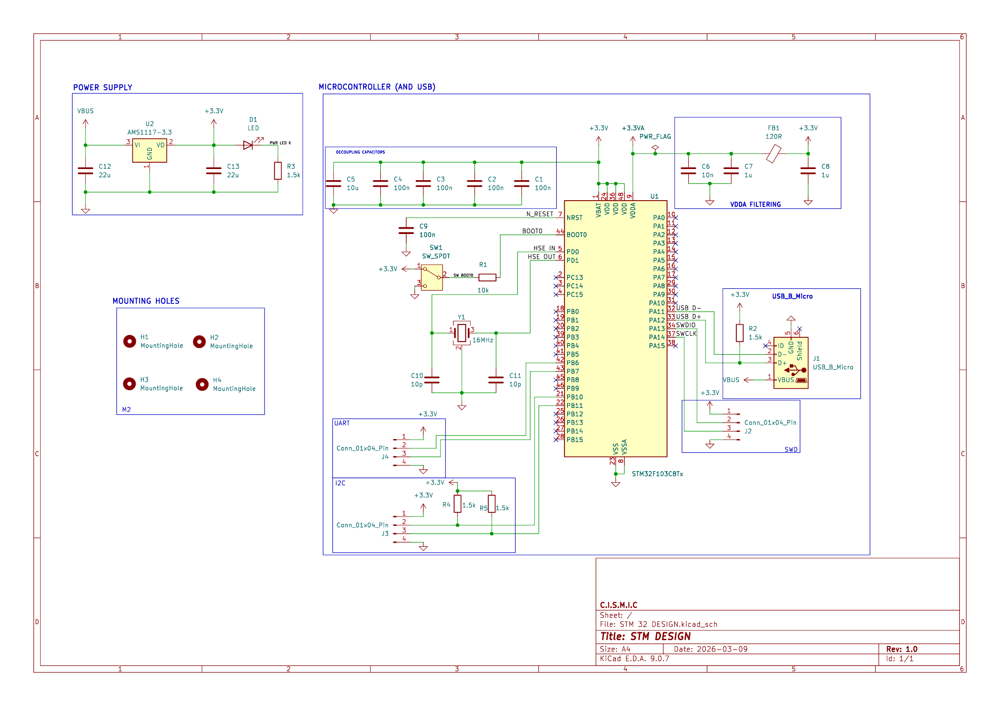
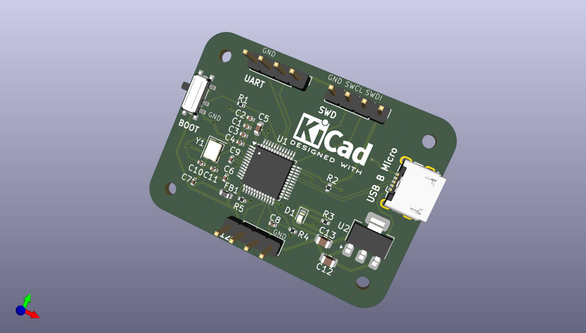
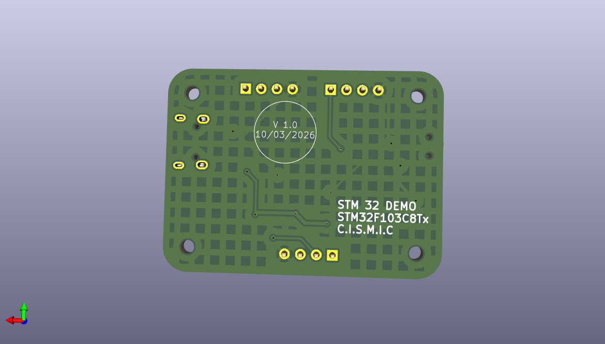

# STM-DESIGN-STM32F103C8Tx
Custom STM32F103C8T6 development board designed in KiCad. The design includes USB power input, AMS1117 3.3V regulation, SWD programming interface, UART and I2C headers, external 16 MHz crystal oscillator, and proper decoupling and filtering for stable MCU operation.

## Overview
This repository contains the KiCad design files for a custom STM32F103C8T6 development board. The board integrates power regulation, USB connectivity, programming/debugging interfaces, and communication headers for embedded development.

The project was designed using KiCad 9 and demonstrates the complete workflow of schematic design, PCB layout, and manufacturing file generation.

## Features
- STM32F103C8T6 ARM Cortex-M3 microcontroller
- USB Micro-B interface
- 3.3V voltage regulation using AMS1117
- 16 MHz external crystal oscillator
- SWD programming and debugging interface
- UART communication header
- I2C communication interface
- Power indication LED
- Proper decoupling and analog filtering
- Mounting holes for mechanical support

## Hardware Architecture

### Power Supply
The board is powered through a USB Micro-B connector. The input voltage (VBUS) is regulated to 3.3V using an AMS1117-3.3 linear voltage regulator.  
Filtering capacitors are used to stabilize the supply voltage and reduce noise.

### Microcontroller
The main controller used is the STM32F103C8T6, a 32-bit ARM Cortex-M3 microcontroller.  
It operates at 3.3V and supports multiple communication peripherals including UART, I2C, SPI, and USB.

### Clock System
An external 16 MHz crystal oscillator is connected to the MCU to provide a stable clock source.  
Two load capacitors are used to stabilize the oscillator.

### USB Interface
The microcontroller is connected to a USB Micro-B connector through the D+ and D- lines.  
A pull-up resistor is used to enable USB device detection.

### Debugging Interface
An SWD (Serial Wire Debug) interface is provided for programming and debugging using tools such as:

- ST-Link
- OpenOCD
- STM32CubeProgrammer

### Communication Interfaces
The board exposes communication headers for external peripherals:

**UART**
- TX
- RX
- GND
- 3.3V

**I2C**
- SDA
- SCL
- GND
- 3.3V

### Analog Power Filtering
A ferrite bead and filtering capacitors are used to isolate the analog supply (VDDA) from digital noise.

### Decoupling
Multiple decoupling capacitors are placed near the MCU power pins to ensure stable operation.

## Tools Used
- KiCad 9.0
- STM32F103C8T6 Microcontroller
- AMS1117-3.3 Voltage Regulator

## Applications
This board can be used for:

- Embedded systems development
- STM32 firmware experimentation
- Learning ARM Cortex-M microcontrollers
- Rapid prototyping
- Educational embedded electronics projects

## Author
Designed as part of an embedded hardware design project by HAMMILTON NYAMACHE  using KiCad.

## PCB Design
### Shcematic

### Top Layer

### Bottom Layer

